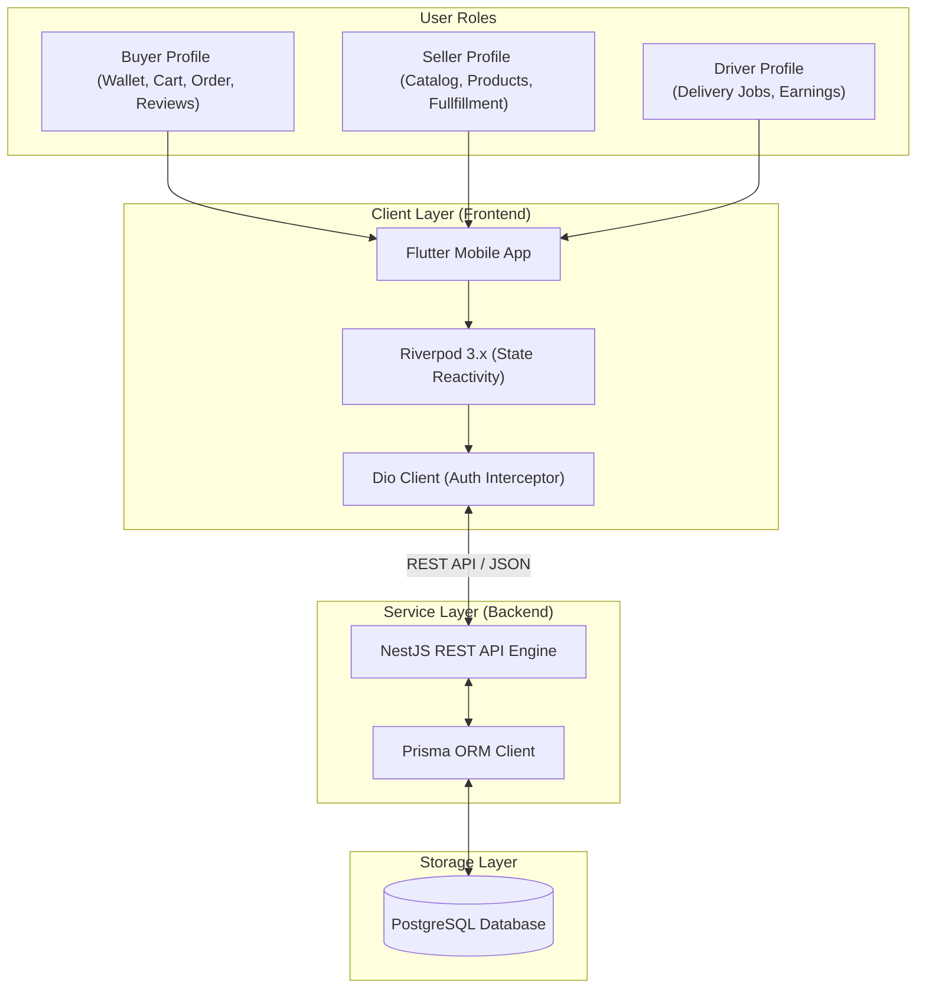

# 🐳 Seapedia Monorepo

[](https://nestjs.com)
[](https://prisma.io)
[](https://postgresql.org)
[](https://flutter.dev)
[](https://riverpod.dev)
[](https://opensource.org/licenses/MIT)

**Seapedia** is a modern, high-performance, multi-role maritime marketplace application. Built as a monorepo, it houses both the scalable backend service engine and the highly responsive mobile frontend application. 

This repository is designed to facilitate seamless developer experiences across the full stack, utilizing NestJS for server-side logic and Flutter for client interface.

---

## 🗺️ Monorepo Navigation

To jump straight into the technical setup, development workflows, and architectural guides of specific subsystems, use the links below:

*   **[⚙️ Backend Engine Documentation](./backend/README.md)**: Local installation, environment configuration, database migration guides (Prisma + PostgreSQL), and Swagger API details.
*   **[📱 Frontend Mobile Documentation](./frontend/README.md)**: Mobile codebase architecture (MVVM), state reactivity engine (Riverpod 3.x), Dio API clients, local persistence (Secure Storage), and multi-platform compilation guides.

---

## 🏗️ System Architecture

Seapedia divides operations into three primary user roles: **Buyer**, **Seller**, and **Driver/Courier**. The entire platform interacts through a modern REST API interface powered by NestJS and persisted via Prisma ORM to a PostgreSQL database.



### Key Subsystem Roles
1.  **Buyer**: Can browse products, manage shopping carts, write reviews, handle wallets (top-up, checkout, refund), and track orders.
2.  **Seller**: Configures store profiles, list/manage products (CRUD), and monitors incoming store orders.
3.  **Driver**: Views and accepts shipping/delivery jobs (`DeliveryJob`), updates delivery statuses, and tracks overall delivery earnings.

---

## 🛠️ Global Prerequisites

Before checking out and running either workspace, make sure the following development kits are installed globally on your machine:

*   **Node.js (v22+)** and **npm** for running the NestJS server engine.
*   **Flutter SDK (v3.x)** and the **Dart SDK** configured in your environment path.
*   **PostgreSQL (v15+)** database running locally or accessible via a network string.
*   **Git** for version control.

---

## 📁 Directory Structure

```text
seapedia/
├── backend/            # NestJS Backend API Engine
│   ├── src/            # NestJS Source Modules
│   └── prisma/         # Prisma Schemas and Seed Scripts
└── frontend/           # Flutter Mobile Application
    ├── lib/            # Flutter App Source Files
    └── pubspec.yaml    # Flutter Package & Dependencies Manifest
```

